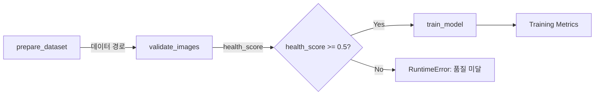

# Layer 4: Orchestration

## 개요

Prefect 기반 워크플로우 오케스트레이션 레이어입니다. 데이터 준비 → 검증 → 학습을 단일 파이프라인으로 엮고, 스케줄링과 에러 핸들링을 제공합니다.

## 파이프라인 구조



## 실행 방법

### 파이프라인 1회 실행

```bash
# 기본 설정 (ResNet18, CIFAR-10 데모)
uv run python -m src.orchestration.serve --run-once

# 커스텀 설정
uv run python -m src.orchestration.serve --run-once \
    --model-name resnet50 --epochs 20 --data-dir data/raw/my-dataset
```

### 스케줄링된 배포

```bash
# 매주 월요일 새벽 2시 (기본)
uv run python -m src.orchestration.serve

# 매일 새벽 2시
uv run python -m src.orchestration.serve --cron "0 2 * * *"
```

### Makefile

```bash
make pipeline          # 파이프라인 1회 실행
make pipeline-serve    # 스케줄링 배포 시작
```

## Tasks

| Task | 설명 | 재시도 | 타임아웃 |
|------|------|--------|---------|
| `prepare_dataset` | 데이터셋 존재 및 구조 확인 | 1회 (30초 대기) | - |
| `validate_images` | CleanVision 이미지 품질 검증 | 1회 (10초 대기) | - |
| `train_model` | PyTorch 학습 + MLflow 트래킹 | 없음 | 2시간 |

## 데이터 품질 게이트

파이프라인은 학습 전에 데이터 품질을 검증합니다. `min_health_score` (기본: 0.5) 미만이면 학습을 중단합니다.

```python
# 품질 게이트 비활성화
training_pipeline(min_health_score=0.0)

# 엄격한 품질 요구
training_pipeline(min_health_score=0.9)
```

## Prefect 서버 연결

파이프라인은 Prefect 서버에 연결하여 실행 상태를 추적합니다.

```bash
# 환경변수로 Prefect API URL 설정 (기본: localhost)
export PREFECT_API_URL=http://localhost:4200/api

# Docker 내부에서는
export PREFECT_API_URL=http://prefect-server:4200/api
```

## MLflow 연결

MLflow 서버의 접속 URI는 실행 환경에 따라 다릅니다:

| 환경 | URI | 설명 |
|------|-----|------|
| 로컬 개발 | `http://localhost:5050` | 기본값 (macOS 포트 5000 충돌 방지) |
| Docker 내부 | `http://mlflow:5000` | Docker 네트워크 내부 서비스명 사용 |

`serve.py`와 `training_pipeline.py`의 기본값은 로컬 개발 URI (`http://localhost:5050`)입니다. Docker 환경에서는 `--mlflow-tracking-uri http://mlflow:5000`으로 변경하거나 `MLFLOW_TRACKING_URI` 환경변수를 설정하세요.

## 에러 핸들링

- **데이터 누락**: `prepare_dataset`가 `FileNotFoundError` 발생
- **데이터 품질 미달**: 파이프라인이 `RuntimeError` 발생 (health_score 기반)
- **학습 실패**: `train_model` 태스크 실패 → Prefect UI에서 확인 가능
- **학습 타임아웃**: 2시간 초과 시 자동 중단
